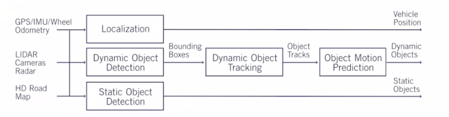
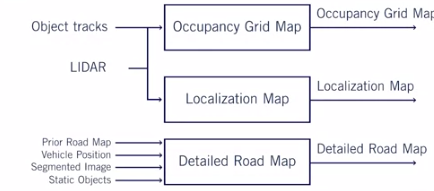
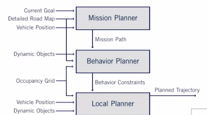
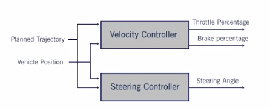

# Module 2 - Self-Driving Hardware and Software Architectures

## Lesson 1 - Sensors and Computing Hardware
Broadly, sensors may be classified as either **exteroceptive** or **propiroceptive**. They
refer to censoring that gathers data about the surroundings of the vehicle, or inner data
from the vehicle.

**Examples of external sensors:**

**Cameras**

Can be arranged in either a single camera or a stereo arranjement to perform depth calculation.
Cameras parameters are tipically **resolution**, **field of view**, **dynamic range** (difference 
between the lightest and darkest pixels).

**LIDAR**

This type of sensor shoots beams of light in all directions and makes a 3D scene of the environment.

**Radar**

Same mechanism as LIDAR, however instead of light, it uses a different wavelength. They can be selected
based on their trade-off between the field of view and its range.

**Sonar**

Same mechanism as both Radar and Lidar, but it uses soundwaves to make measurements. 

**Examples of Internal Sensors**

**GNSS - Global Navigation Satellite System** 

These are a series of systems that make measurements such as speed, position, acceleration based
on satellite. GPS is one of the several systems within the scope of GNSS. As a quick side-note
GPS is a constellation of satellites proprietary from USA, but Russia, European Union, and China,
also happen to have their on satellites. Bottom line is, if a give device could perform computations
based on more than one of these collections of satellites, than the system is more robust. 

**IMU - Inertial Measurement Unit** 

This family of sensors reports acceleration, orientation, angular speed and other types of quantities 
related to mechanical movement. Several technologies may be adopted.

**INS = IMU + GNSS**

Inertial Navigation Systems are composed of the fusion of IMU's and GNSS's systems. They are commercially 
delivered as one single unit.

As a supplementary reading [these class notes](http://wavelab.uwaterloo.ca/sharedata/ME597/ME597_Lecture_Slides/ME597-4-Measurement.pdf)
are proposed.

[This thesis](https://repository.tudelft.nl/islandora/object/uuid:2ae44ea2-e5e9-455c-8481-8284f8494e4e) is a good survey of the
different types of sensors used for automated vehicles. 

## Lesson 2 - Hardware Configuration Design 
Where should sensors be placed?

In roads, sensors should be able to sense narrow and long range in both lateral and longitudinal
movements. 

In urban scenarios, there are mainly 6 kinds of maneuvers:

No need for long range
* Emergency stop
* Maintain Speed
* Lane changing

Long range is required
* Overtaking (cross a car)
* Turning and crossing intersections
* Passing roundabouts

## Lesson 3 - Software Architecture

**Environment Perception**

Localizing the position of the vehicle in the space, and identifying objects in the environment 
around the vehicle. 

The following image taken from the slides breaks down into the main modules:

**Environmental Maps**

**Motion Planning**

Several layers of abstraction are required for the car to plan where it should go.

**Vehicle Controller**

This is the part which planning is converted into physical quantities which the car understands.

