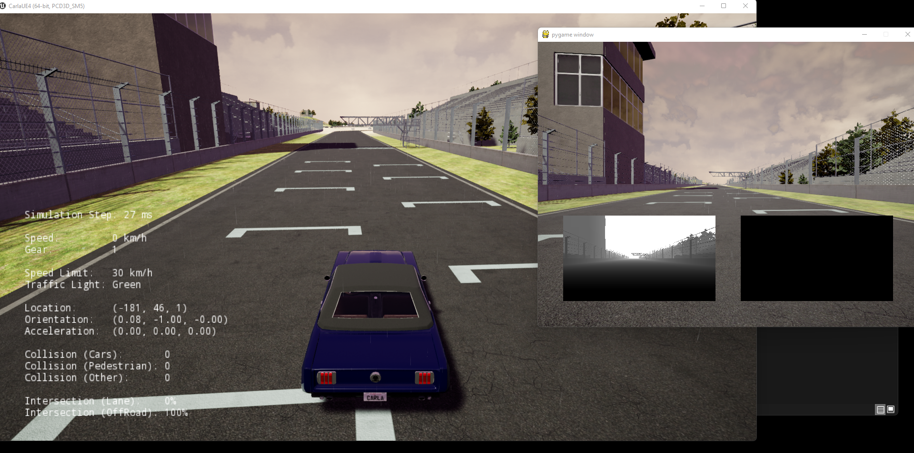

# Setting-Up CARLA Simulator on Windows

CARLA is an amazing tool, yet fully understanding the simulator is too much information. 
Luckily, the professors behind the course encapsulated the bare minimum for using the simulator
and offered a straight foreword tutorial on how to used for the objectives of this course.

I wish I could perform this course in a LINUX machine, yet I don't have a powerfull Linux computer; 
hence, the alternative is to use a pretty decent Windows computer powered with a GEForce GTX-1650. 
I followed the basic tutorial and it ran smoothly. To save my time, I decided to stick to windows. 

## Note about the CARLA VERSION in the Tutorial
The CARLA version is based on [0.8.4](https://github.com/carla-simulator/carla/releases/tag/0.8.4), given
that the binaries differ from the public available files, I don't feel comfortable to upload them in my
personal github page, hence I am going to simply upload notes,scripts and pictures. If one is interested
in using the simulator, I highly encorage to enroll the course [in this link](https://www.coursera.org/learn/intro-self-driving-cars?=)

As mentioned in the course notes, to understand more about the simulator, it is recommended to perform 
a local compilation and installation of the software. Probably the best resource for such thing would 
be the [CARLA's Doc Page](https://carla.readthedocs.io/en/latest/).

## Configuring the Environment
To setup the environment one can install the libraries directly in the python root, 
or use Anaconda to encapsulate the python modules, thus have more control on the versions
of python that is being used. 

Assuming one have Anaconda installed, and added to the PATH, setting up the env can be performed
by running the following commands on CMD.

Python 3.5 was chosen for compatibility between anaconda and pygame module. Also, the course recommends
either python 3.5.x or 3.6.x

```
conda create -n coursera python=3.5
conda install -c anaconda pillow -n coursera
conda install numpy -n coursera
conda install -c anaconda protobuf -n coursera
conda install -c cogsci pygame -n coursera
conda install -c conda-forge matplotlib -n coursera
conda install -c conda-forge future -n coursera
```

run `conda list` to check if the libraries have been included.

## Testing the Simulator
Assuming one is in the correct directory, let's assume `C:\\Simulator\`, the following commands can be 
called via `cmd`.

```
\\ Calling the simulator in standard Map
CarlaUE4.exe -windowed -carla-no-networking 

\\ Calling the simulator in a different map
CarlaUE4.exe /Game/Maps/RaceTrack -windowed -carla-no-networking
CarlaUE4.exe /Game/Maps/Town01 -windowed -carla-no-networking
CarlaUE4.exe /Game/Maps/Town02 -windowed -carla-no-networking
CarlaUE4.exe /Game/Maps/FlatEarth -windowed -carla-no-networking

\\ Calling the simulator with lower resolution
CarlaUE4.exe /Game/Maps/RaceTrack -windowed -carla-no-networking -quality-level=Low

\\ Calling the simulator with fixed fps
CarlaUE4.exe /Game/Maps/RaceTrack -windowed -carla-no-networking  -benchmark -fps=20
```

Carla Simulation can be configured with different command line arguments. For instance, in the above
piece-of-code, the flags `-benchmark -fps=20` fixes the simulation-time step. These nuances of the simulation
may be understood by properly reading manual pages [such as this one](https://carla.readthedocs.io/en/stable/configuring_the_simulation/#fixed-time-step).

## Testing Client-Server Interaction
The concept behind CARLA is client-server model. That means a main application starts a server, and another application (or several
other ones) hooks to this server and interact with this main application. 

In the provided environment, this can be performed by launching two separated programs one is the same we have already 
launched `CarlaUE4.exe` with an additional flag `-carla-server` the other one is one of the scripts under `PythonClient\`. 

```
// TERMINAL A - Carla SERVER
 CarlaUE4.exe /Game/Maps/RaceTrack -windowed -carla-server -benchmark -fps=20

// TERMINAL B - manual_control.py client application
conda activate coursera # Make sure to load the python version and additional applications
python manual_control.py 
```

The final result should be two windows running different views of the same application: One for the client
another for the host.



